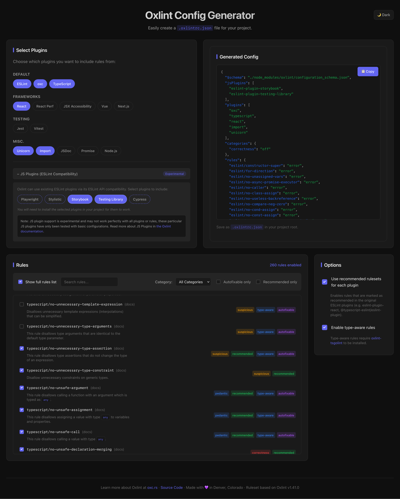

# Oxlint Config Generator

[View the site here](https://connorshea.github.io/oxlint-config-generator/)



A Vue 3 + Vite static website that makes it easy to create Oxlint configuration files.

[Oxlint](https://oxc.rs) is a fast, ESLint-compatible linter for JavaScript and TypeScript written in Rust. It has a lot of rules from various ESLint plugins, and I wanted to create a simple application to set up a configuration file based on the recommended rules from the original plugins.

## Development

### Prerequisites

- Node.js (v24 or higher)
- pnpm

### Setup

```sh
# Install dependencies
pnpm install

# Generate data files (rules and plugin information)
pnpm generate:all
```

### Available Commands

```sh
# Development server
pnpm dev

# Build for production
pnpm build

# Preview production build
pnpm preview

# Lint the codebase
pnpm lint

# Format the codebase
pnpm fmt

# Check formatting
pnpm fmt:check

# Generate rules data from oxc/website repository
pnpm generate:rules

# Generate plugin data from ESLint plugins
pnpm generate:plugins

# Generate all data files
pnpm generate:all
```

## Tools Used

- **Vue 3** with Composition API
- **Vite** for fast development and building
- **TypeScript** for type safety
- **oxlint** for linting
- **oxfmt** for code formatting
- **pnpm** as package manager

## License

MIT
